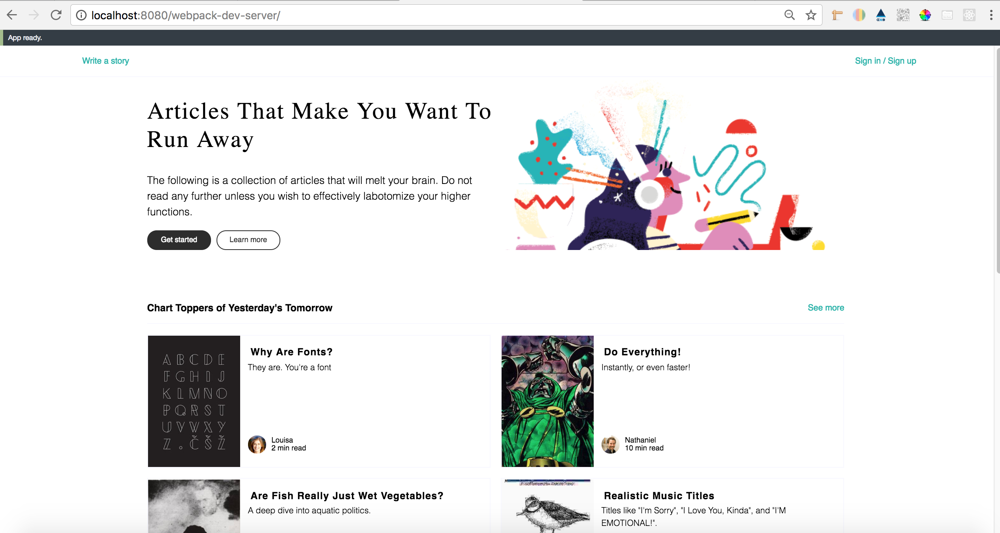

# React Starter Kit

To install the dependencies:

```
npm install
```

To fire up a development server:

```
npm start
```

Once the server is running, you can visit:

* `http://localhost:8080/`

--------------------------------

# React Static Comp

### Specification
This is my React Static Comp. This project is designed to get us comfortable with basic React principles and to keep up your CSS skills. I feel that I have gained those skills and this is my version of the Medium webiste.

### Medium Website Original


### Medium Website My Version
